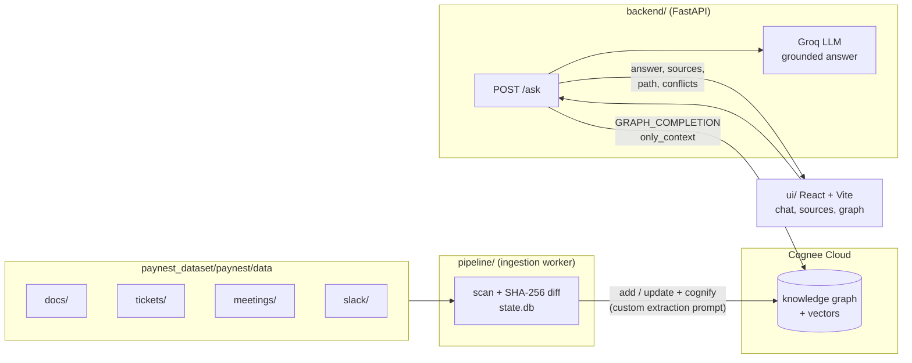

# PayNest Brain: a mini Company Brain on Cognee

> Ask your company anything, and see not just the answer but **why it's true** and **who to talk to**.

**Live demo:** [paynest-topaz.vercel.app](https://paynest-topaz.vercel.app)

Built for the **Paytm AI Hackathon (Ignite Room)**, Problem Statement 2: *Build a mini Company Brain using Cognee*.

---

## The problem

Company knowledge is scattered across documents, tickets, meeting notes and Slack. Simple questions like *"Why does our refund system retry this way?"* or *"Who owns this service?"* mean digging through four tools and pinging three people.

The reasoning behind decisions gets lost along the way. Docs go stale, while the real decisions happen in meetings and chat threads. People end up acting on outdated information.

## What PayNest Brain does

PayNest Brain is a shared knowledge layer for **PayNest**, a fictional Noida fintech. It ingests four kinds of company data into a single Cognee knowledge graph: docs and RFCs, tickets, meeting notes, and Slack threads. People can then ask it questions in plain English.

Every answer:

- **Is grounded.** It is written only from retrieved company knowledge, and it cites a source ID after each fact, e.g. `(PAY-231)` or `(MTG-2026-08-12)`.
- **Shows the relationships behind it.** A graph view displays the path the answer followed: incident → ticket → meeting decision → RFC → engineer.
- **Flags conflicts.** When sources disagree, it trusts the newest one and marks the older source as outdated. For example, RFC-014 says 3 retries, but a later incident review changed it to 5.
- **Refuses instead of guessing.** If the data doesn't cover the question, it replies `Not found in company knowledge.`

### Try these questions

| Question | What it shows |
|---|---|
| Why does refund-service retry refunds with exponential backoff, and who should I contact if it breaks? | Multi-hop: PAY-231 → MTG-2026-08-12 (Priya Sharma decides) → RFC-014 → Rahul Verma, with backup from DOC-004 |
| What is the current maximum retry count for refunds? | Conflict detection: answers 5 and flags RFC-014 (3 retries) as outdated |
| Why were settlements delayed for Tier-2 merchants in August, and which decision caused it? | Multi-hop: PAY-245 → fraud-guard rule FG-R9 → Risk sync after an RBI audit |
| Which earlier decision indirectly led to the ledger duplicates? | Three-hop causal chain: RFC-014 → INC-017 → replay → PAY-260 |
| Which cloud provider does PayNest host its services on? | Grounding: refuses, because it's not in the data |

---

## Architecture



The pipeline and the API never talk to each other; Cognee Cloud is the only thing they share. The API is stateless and can run as many replicas as needed. The worker runs as exactly one replica, so two workers never ingest the same files.

### Ingestion (`pipeline/`)

1. **Scan** the data folder and hash each file with SHA-256.
2. **Diff** the hashes against `state.db` (SQLite) and skip unchanged files.
3. **Add or update** files in Cognee:
   - New files are added, tagged with a **node set** per source type (`docs`, `tickets`, `meetings`, `slack`) and with metadata (`doc_id`, `source_type`, `source_path`).
   - Changed files are updated in place.
4. **Cognify** once per batch, using a **custom extraction prompt** that:
   - pins record IDs (`PAY-231`, `RFC-014`, …) as node names;
   - uses full names for people (`Priya Sharma`);
   - captures relations such as *decided, approved, owns, implemented, blocked by, supersedes*;
   - records the settings each decision sets (e.g. max retries 3 or 5).
5. **Record state** only after cognify succeeds, so a failed run is retried on the next pass.

Run it once with `--once`, or as a loop every `INGEST_INTERVAL_SECONDS`. Dropping a new file into the folder makes it searchable on the next pass.

### Answering (`backend/`)

1. **Retrieve.** Cognee `GRAPH_COMPLETION` with `only_context=True` returns the relevant subgraph and chunks for the question.
2. **Answer.** Groq (`llama-3.3-70b-versatile`) writes the answer from that context only, under a strict grounding prompt with inline citations and a newest-source-wins rule for conflicts.
3. **Fall back** in two stages, so the answer still stays grounded:
   - If Groq fails (e.g. a rate limit), Cognee's own `GRAPH_COMPLETION` writes the answer.
   - If graph completion fails, `RAG_COMPLETION` (plain vector retrieval) writes it.
4. **Post-process** the answer before returning it:
   - **Citations:** source IDs are pulled out of the answer text and mapped to source cards. Each card shows the title, date, type and the two most relevant sentences from that source.
   - **Conflicts:** `OUTDATED:` lines are parsed into `{outdated, current, note}`.
   - **Relationship path:** Cognee's context lines (`A --[relation]--> B`) are parsed into graph edges, with chunk bookkeeping edges filtered out.
   - **Refusals:** a refusal returns empty sources, so the UI never shows citations for an answer that doesn't exist.

The API retries once on transient failures, then returns a clear `503` error.

### UI (`ui/`)

The UI is built with React 19, TypeScript, Vite and `react-force-graph-2d`.

- **Chat** with suggested demo questions and clickable citations.
- **Source cards** sorted oldest first, with outdated sources visibly marked.
- **Relationship graph** of the hops behind each answer.
- **Offline fallback:** if the backend is unreachable, the demo questions show clearly labelled sample answers.

---

## The dataset

The dataset has **23 records across 4 source types** for PayNest, a fictional company. It covers 6 people, 4 services (`refund-service`, `settlement-service`, `ledger-service`, `fraud-guard`) and a partner bank, **Kosha Bank**.

| Type | Count | Examples |
|---|---|---|
| Docs / RFCs | 7 | RFC-014 (refund retry strategy), DOC-004 (service ownership), DOC-006 (Kosha Bank integration) |
| Tickets (JSON) | 7 | PAY-231, PAY-245, PAY-252, PAY-260, INC-017 |
| Meeting notes | 4 | Payments Weekly Syncs, Risk & Compliance Sync, INC-017 incident review |
| Slack threads | 5 | #payments-eng, #incidents, #risk-alerts, #general |

Every file starts with a header (`SOURCE_TYPE`, `ID`, `DATE`, author or channel). People, services and IDs are named identically across all files, so entities link correctly in the graph.

The dataset was designed around **three planted multi-hop chains**, one deliberate **conflict**, and two **unanswerable** questions.

`paynest_dataset/paynest/eval/eval_questions.txt` holds 12 evaluation questions with their expected facts and sources. This file is **never ingested**.

---

## Repository structure

```
mini-company-brain/
├── pipeline/                 # ingestion worker
│   ├── main.py               # loop or --once
│   ├── ingest.py             # scan → hash → add/update → cognify → state.db
│   ├── cognee_client.py      # the only file that knows Cognee's REST API
│   └── config.py
├── backend/                  # FastAPI
│   ├── api.py                # POST /ask, GET /health
│   ├── brain.py              # retrieval, grounded answer, citations, conflicts, graph path
│   └── config.py
├── ui/                       # React + Vite frontend
│   └── src/ (App.tsx, Graph.tsx, api.ts, mock.ts)
├── paynest_dataset/paynest/
│   ├── data/                 # docs/, tickets/, meetings/, slack/  (ingested)
│   └── eval/                 # eval_questions.txt                  (never ingested)
└── PLAN.md                   # implementation plan
```

---

## Running locally

**Prerequisites:** Python 3.10+, Node 20+, a Cognee Cloud API key, and optionally a Groq API key.

### 1. Ingest the data

```bash
pip install -r pipeline/requirements.txt
cp pipeline/.env.example pipeline/.env   # set COGNEE_API_URL and COGNEE_API_KEY
python -m pipeline.main --once           # single pass; omit --once to keep watching the folder
```

### 2. Start the API

```bash
pip install -r backend/requirements.txt
cp backend/.env.example backend/.env     # set COGNEE_API_URL, COGNEE_API_KEY, optionally GROQ_API_KEY
uvicorn backend.api:app --port 8000      # run from the repo root
```

Check it with `curl localhost:8000/health`, which returns `{"status": "ok", "sources": 23}`.

### 3. Start the UI

```bash
cd ui
npm install
VITE_API_URL=http://localhost:8000 npm run dev
```

### Environment variables

| Variable | Used by | Purpose |
|---|---|---|
| `COGNEE_API_URL` | pipeline, backend | Cognee Cloud tenant URL |
| `COGNEE_API_KEY` | pipeline, backend | Cognee Cloud API key |
| `COGNEE_DATASET` | pipeline, backend | Dataset name (default `paynest`) |
| `DATA_DIR` | pipeline, backend | Data folder (default `paynest_dataset/paynest/data`) |
| `INGEST_INTERVAL_SECONDS` | pipeline | Worker loop interval (default `300`) |
| `GROQ_API_KEY` | backend | Optional. When set, Groq writes answers from Cognee's context |
| `GROQ_MODEL` | backend | Default `llama-3.3-70b-versatile` |
| `VITE_API_URL` | ui | Backend URL (default `http://localhost:8000`) |

---

## API

### `POST /ask`

**Request:**

```json
{ "question": "What is the current maximum retry count for refunds?" }
```

**Response:**

```json
{
  "answer": "The current maximum is 5 retries with a 10 second base delay (MTG-2026-09-04, SLACK-2026-09-10). RFC-014 is outdated.",
  "sources": [
    { "id": "MTG-2026-09-04", "type": "meeting", "title": "INC-017 incident review", "date": "2026-09-04", "snippet": "..." }
  ],
  "path": [
    { "source": "Priya Sharma", "target": "MTG-2026-09-04", "label": "approved in" }
  ],
  "conflicts": [
    { "outdated": "RFC-014", "current": "MTG-2026-09-04", "note": "Max retries raised from 3 to 5 after INC-017." }
  ]
}
```

A question the data doesn't cover returns `"answer": "Not found in company knowledge."` with empty `sources`, `path` and `conflicts`.

### `GET /health`

Returns `{"status": "ok", "sources": <number of indexed source files>}`.

The `/ask` endpoint is plain REST, so an AI agent can call it as a tool exactly the way the UI does.

---

## Design decisions

- **Graph retrieval, not just vector search.** The key questions are multi-hop ("which decision *indirectly* caused this?"). The graph links a ticket to a meeting, the meeting to an RFC, and the RFC to a person. Plain vector search would find each document on its own but miss the chain between them.
- **Custom extraction prompt.** Pinning record IDs and full names as node names stops Cognee from creating duplicate entities ("Priya" vs "Priya Sharma"). It also means graph nodes match the IDs the answers cite.
- **Node sets per source type.** Every node keeps its origin (doc, ticket, meeting or Slack), which lets the system label and filter sources.
- **Newest source wins.** Real companies have stale docs. Instead of averaging conflicting facts, the answer takes the most recent decision and says explicitly which source it supersedes.
- **Incremental, idempotent ingestion.** Content hashes in `state.db` mean only new or changed files are processed. State is written only after cognify succeeds, so a failed run is retried on the next pass.
- **Graceful degradation.** Groq → Cognee graph completion → Cognee RAG on the backend, plus labelled sample answers in the UI. The demo keeps working even if a provider is rate-limited.

---

## Limitations and next steps

- **Deletes:** removed files are not yet deleted from Cognee.
- **Access control:** there is no authentication or per-team permissions yet. Separate datasets per team are the natural next step.
- **Connectors:** ingestion reads a watched folder only. Next would be live connectors for Slack, Jira, Google Drive and Git.
- **Evaluation:** the eval set is scored manually today. An automated scorer for accuracy and citation coverage would come next.
- **Agents:** `/ask` could also be exposed as an MCP tool so agents can call it natively.

---

## Tech stack

**Knowledge layer:** Cognee Cloud · **LLM:** Groq (Llama 3.3 70B) · **Backend:** Python, FastAPI, httpx · **Ingestion:** Python worker with SQLite state · **Frontend:** React 19, TypeScript, Vite, react-force-graph-2d · **Hosting:** Vercel (UI)
